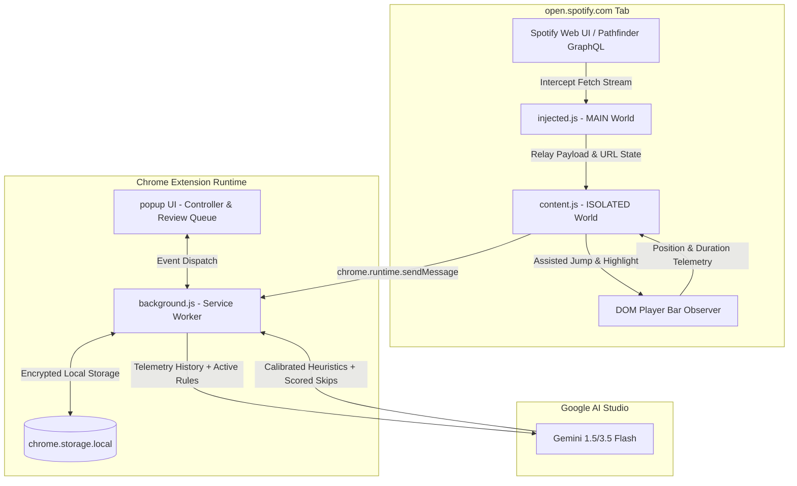

# Culler v2

A Chrome extension that intercepts live Spotify web sessions, learns user skip/keep habits via natural playback telemetry, and uses Gemini Flash heuristics to cull bloated playlists with assisted in-browser manual review.

Evolved from [Culler v1](https://github.com/mnarla/culler) (an offline experiment exploring local 8B self-correction loops on an old Dell server). Culler v2 trades offline batch processing and synthetic scrobble proxies for real-time telemetry, zero-credential network interception, and instant cloud-assisted curation.

---

## Why v2? (Comparing to Culler v1)

In Culler v1, auditing an 820-track playlist required:
1. Manually downloading an [Exportify](https://exportify.app/) CSV.
2. Enriching tracks via Last.fm API keys (which only had lifetime play counts, missing whether you still liked the track *recently*).
3. Running local quantized GGUFs over SSH on an Intel i7 CPU server (~41 hours estimated for 820 tracks at ~250s/track).
4. Reviewing static database tables without an easy way to locate tracks inside Spotify.

**Culler v2 rebuilds the entire workflow directly in the browser:**
- **No Spotify API keys required:** Intercepts Spotify's internal Pathfinder GraphQL queries directly in the client (`injected.js` in `MAIN` world).
- **True listening telemetry:** Automatically records skips vs. keeps as you listen in Spotify web (`< 20%` duration = skip, `> 65%` = keep) instead of relying on stale lifetime scrobbles.
- **Fast batch inference:** Full 800+ track playlists are evaluated in ~3–5 seconds using parallel chunked Gemini Flash calls instead of 40+ hours on CPU.
- **Assisted Manual Review:** A dedicated Review Queue scrolls Spotify's virtualized player directly to candidate rows and highlights them, eliminating the pain of manually searching through massive playlists.

---

## Architecture & Data Flow



---

## Key Features

### 1. Non-Destructive Pathfinder Interception & Auto-Pagination
- Listens to Spotify’s internal GraphQL API (`pathfinder/v2/query`) without altering payloads or triggering anti-bot protections.
- Includes a built-in auto-pagination engine that fetches up to 1,000+ tracks in 50-track batches with token expiry circuit breakers (`401`/`403` detection).
- Tracks SPA route changes via History API patching (`pushState`/`replaceState`) to isolate playlists and prevent predictions from bleeding across different albums or playlists.

### 2. Live Passive Telemetry & Calibration
- Tracks song progression without audio fingerprinting.
- Filters out Spotify ads automatically so ads never poison the skip/keep calibration data.
- User overrides during review (keeping a suggested skip) feed directly back into prompt heuristics as negative feedback for continuous calibration.

### 3. Assisted Manual Review & Virtual Scroller (Zero Write Access)
- **100% Read-Only Safety:** Culler never requests write permissions, never calls playlist mutation endpoints, and never modifies playlists automatically.
- **Assisted Jump-to-Track:** Instead of making you search through hundreds of songs manually, the **Review Queue** scrolls the Spotify web player directly to the flagged song and temporarily highlights the row.
- **You Remain in Control:** You decide whether to remove it using Spotify's standard interface (clicking Spotify's `...` menu or pressing Delete) or keep it in your rotation.

---

## v1 vs. v2 Comparison

| Feature | Culler v1 | Culler v2 |
| :--- | :--- | :--- |
| **Runtime** | Python / SSH on Dell Latitude 5500 CPU | Manifest V3 Chrome Extension |
| **Spotify Data** | Exportify manual CSV dump | In-page GraphQL stream interception |
| **Ground Truth** | Manual binary labels + Last.fm lifetime scrobbles | Passive playback telemetry (skip `<20%`, keep `>65%`) |
| **Inference Engine** | Local Qwen3 8B Q4_K_M (`llama-cpp-python`) | Gemini 1.5 / 3.5 Flash (BYOK API Key) |
| **Speed (820 tracks)** | ~41 hours (CPU bound) | ~3 to 5 seconds (parallel chunks) |
| **Removal Workflow** | Manual cross-reference with CSV | Assisted manual review (virtual scroll & highlight; zero writes) |
| **Storage** | SQLite (`skip_predictor.db`) | `chrome.storage.local` |

---

## Installation & Setup

1. Clone this repository:
   ```bash
   git clone https://github.com/mnarla/culler-v2.git
   ```
2. Open Google Chrome and navigate to `chrome://extensions/`.
3. Enable **Developer mode** (top-right toggle).
4. Click **Load unpacked** and select the root directory of `culler-v2`.
5. Open [open.spotify.com](https://open.spotify.com/) and pin the **Culler** extension to your toolbar.
6. Open the extension popup, click the settings gear icon, and enter your Gemini API key (stored strictly client-side in your browser).

---

## Tech Stack

- **Extension Platform**: Chrome Manifest V3 (Service Worker + Content Scripts)
- **DOM / Page Interception**: Vanilla JS, History API hooks, WebKit DOM Observers
- **Models**: Google Gemini 1.5 / 3.5 Flash via REST API
- **Styling**: Spotify-dark responsive design system, JetBrains Mono, Plus Jakarta Sans
