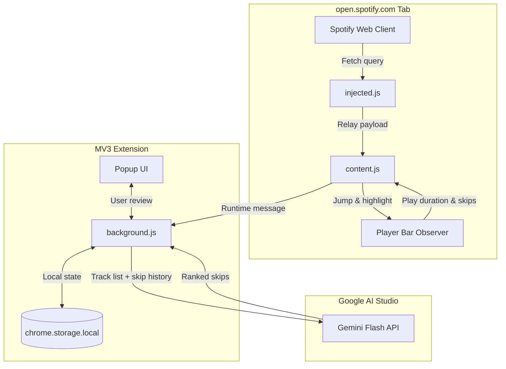

# Culler v2

A lightweight Chrome extension that watches your listening habits on Spotify Web, flags songs you've probably outgrown in large playlists, and helps you jump straight to them to clean things up manually.

> **Note:** This is an unofficial, personal project for educational use. It is not affiliated with or endorsed by Spotify. It works by inspecting Spotify Web's internal GraphQL queries in the browser rather than using Spotify's official developer API, so breaking changes on their end may happen.

---

## Why v2?

[Culler v1](https://github.com/mnarla/culler) was a fun proof-of-concept for running an 8B model locally on an old laptop, but using it in practice was painful. You had to manually export CSVs with Exportify, pull play counts from Last.fm (which only told you if you liked a song four years ago, not today), and wait almost two days for CPU inference to finish on an 800-song playlist. Even then, you were left staring at a spreadsheet and still had to find and remove every track by hand.

v2 moves everything directly into the browser. It monitors your skips in real-time as you listen on Spotify Web, passes the playlist to Gemini Flash in small parallel chunks so it finishes in a few seconds, and gives you a queue that scrolls you directly to candidate songs so you can delete them yourself.

---

## How It Works



### The Workflow

1. **Passive Telemetry:** While you listen to music on Spotify Web, Culler tracks playback duration behind the scenes. Tracks skipped before reaching 20% count as skips, while anything played past 65% counts as a keep. Ads are detected and discarded automatically so they don't mess up your data.
2. **Fast Evaluation:** When you trigger a scan, the playlist is batched into chunks and evaluated by Gemini Flash using your listening history as ground truth. An 800+ track playlist finishes in about 3–5 seconds.
3. **Assisted Review (Zero Write Access):** The extension is strictly read-only. It has no write permissions, never calls delete endpoints, and cannot alter your playlists on its own. Instead, clicking a track in the Review Queue auto-scrolls Spotify's virtualized list directly to that row and highlights it, so you can decide whether to press Delete or keep it. If you choose to keep a flagged track, that override is saved to tune future scans.

---

## How to Use It

You don't need days of listening data to get started. Culler works right out of the box with zero telemetry by scanning for obvious genre and tonal outliers, but doing a quick listening session first makes the predictions significantly sharper.

### 1. Load the Entire Playlist (`Fetch All ⚡`)
Spotify's web player only loads the first 50–100 tracks when you open a playlist page. If your playlist has more songs, you'll see a **Fetch All (X) ⚡** button. Click this first—it auto-paginates Spotify in the background in clean 50-track batches so Culler has the full playlist captured before you scan or listen.

### 2. Instant Scan Without Listening
If you just want immediate results without listening first, click **Scan Playlist (No Session)**. Culler runs your playlist against baseline heuristics and returns candidate skips in 3–5 seconds.

### 3. Or: (Recommended) Run a 20-30 Track Listening Session
Scanning a playlist with zero history works fine for catching obvious outliers (like an acoustic indie ballad buried inside a fast gym playlist). But running a short listening session first gives the calibration loop enough signal to learn your nuanced taste—catching tracks that *fit* the genre on paper, but that you always skip anyway.

1. In the popup, hit **Start Telemetry Session**.
2. Put the playlist on shuffle and listen as you normally would for around **20 to 30 tracks**. Skip what you don't want to hear right now, and let tracks you like play through.
3. Use **Pause Session** anytime you step away or switch to something you don't want recorded.
4. When finished, hit **Stop & Analyze**. Culler feeds your real skip/keep behavior into the calibration loop, updates its rules, and evaluates your unreviewed tracks.


### 4. Review & Locate Tracks (The Review Queue)
Candidate skips appear grouped by confidence tiers (`HIGH`, `MODERATE`, `WORTH-REVIEWING`):

- **Checkboxes:** High-confidence skips are checked by default. Uncheck any song you actually want to keep.
- **Save Feedback:** Clicking **Apply Review & Save Feedback** records any songs you unchecked as negative feedback, ensuring future scans won't flag that artist or vibe again.
- **Jump to Track:** On the review queue screen, clicking any track row auto-scrolls Spotify directly to that song in your playlist and temporarily highlights it. You can review it in context, hit Delete/Backspace in Spotify if you want it gone, or click **Mark Done** in the popup to check it off.
- **Export:** You can also copy the entire report as Markdown or export a `.csv` if you prefer to review everything offline.

---

## v1 vs. v2

| Feature | Culler v1 | Culler v2 |
| :--- | :--- | :--- |
| **Setup** | Python + SSH on a dedicated Dell laptop | Unpacked Chrome extension (MV3) |
| **Data Source** | Manual Exportify CSV export | Live in-browser GraphQL stream |
| **Ground Truth** | Manual labels + Last.fm lifetime playcounts | Real-time playback telemetry |
| **Inference** | Local Qwen3 8B on CPU (~250s/track) | Gemini 3.5 Flash (~3–5s for 800+ tracks) |
| **Track Cleanup** | Cross-referencing SQLite rows by hand | In-browser scroller that jumps to the row |
| **Safety** | Read-only local database | Strictly read-only (zero automated mutations) |

---

## Setup

1. Clone this repository:
   ```bash
   git clone https://github.com/mnarla/culler-v2.git
   ```
2. In Chrome, go to `chrome://extensions/` and turn on **Developer mode** in the top-right corner.
3. Click **Load unpacked** and select the `culler-v2` directory.
4. Open [open.spotify.com](https://open.spotify.com/) and open the extension popup.
5. Click the gear icon to add your Gemini API key (this is stored locally in `chrome.storage.local` and never leaves your machine).

---

## Tech Stack

- **Extension:** Chrome Manifest V3 (Service Worker + Content Scripts)
- **Frontend / Ingestion:** Vanilla JS, MutationObservers, Web History API hooks
- **Inference:** Google Gemini 3.5 Flash via REST
